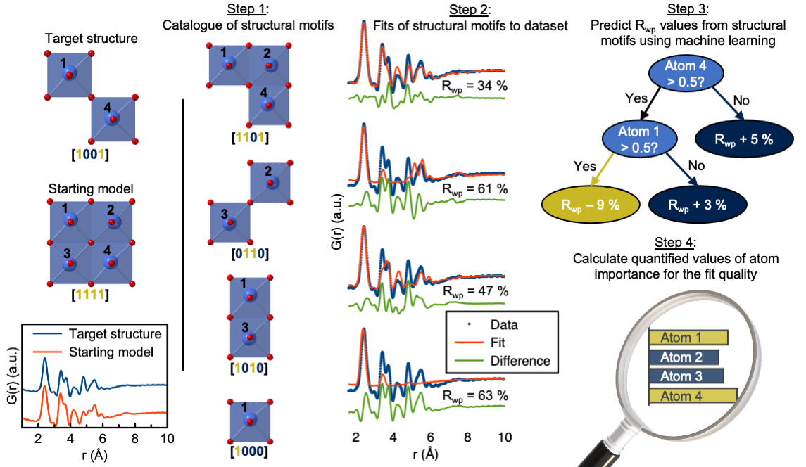

[arXiv]XXX  |  [Paper] XXX

# Machine Learning based Motif Extractor (ML-MotEx)

We provide our code for Machine Learning based Motif Extractor (ML-MotEx), which is a tool to extract structural motifs from numerous fits using interpretable machine learning.
ML-MotEx first builds a catalogue of hundreds or thousands of candidate structure motifs which are all ‘cutouts’ from a chosen starting structure (Step 1), and then fit these individual models to a dataset (Step 2). The results from these fits are then handed to a ML algorithm (Step 3), and using SHAP (SHapley Additive exPlanation) values, the machine identifies which atoms are important for the fit quality (Step 4), such that structural motifs can be extracted from a dataset.

Note that the code to step 1+2 presented here is specific for data analysis of Pair Distribution Function data. If other data is used, one can go directly to step 3+4 of the algorithm which will guide the user to set up the data in the appropriate manner and use step 3+4 of ML-MotEx.



One of the bottlenecks in structural analysis using e.g. Pair Distribution Function (PDF) analysis or other scattering methods is identifying an atomic model for structure refinement. Recently, new modelling approaches have made it possible to test thousands of models against a dataset in an automated manner, but one of the challenges when using such methods is analyzing the output, i.e. extracting structural information from the thousands of fits in a meaningful way. We here use interpretable machine learning to identify structural motifs present in nanomaterials from PDFs based on an automated modelling approach.
We have demonstrated the use of the algorithm on data from 4 different chemical systems consisting of disordered materials and ionic clusters. Furthermore, we showed that the algorithm achieves comparable results using 4 different starting models but the same dataset. ML-MotEx opens for a new type of modelling where each atom or structural feature in a model is assigned an importance value for the fit quality based on Machine Learning. 

# How to use ML-MotEx

- Clone this repo:
```bash
git clone https://github.com/AndyNano/ML-MotEx.git
```

**ML-MotEx_Step1_2**: Generates a catalogue of structure motifs (Step 1) from a starting model and fit these to a PDF (Step 2):

Option 1: Install using requirement.txt files
```bash
cd Install_options/Install_Step1+2/Install_bash
```
```bash
bash install.sh
```

Option 2: Install a predefined anaconda environment

```bash
cd Install_options/Install_Step1+2/Install_condaEnvironment
```

```bash
conda env create -f ML-MotEx_Step1_2.yml
```

Option 3: Run ML-MotEx using a singularity container in the folder "Singularities"

**ML-MotEx_Step3_4**: The results from the fits are handed to a ML algorithm (Step 3), and using SHAP (SHapley Additive exPlanation) values, the machine identifies which atoms are important for the fit quality (Step 4), such that structural motifs can be extracted from a dataset. 

Option 1: Instal using requirement.txt files
```bash
cd Install_options/Install_Step3+4/Install_bash
```
```bash
bash install.sh
```

Option 2: Install a predefined anaconda environment
```bash
cd Install_options/Install_Step3+4/Install_condaEnvironment
```
```bash
conda env create -f ML-MotEx_Step3_4.yml
```

Option 3: Run ML-MotEx using a singularity container in the folder "Singularities"


### Citation
If you use our code or our results, please consider citing our paper. Thanks in advance!

```
@inproceedings{anker2022ML-MotEx,
  title={Extracting Structural Motifs from Pair Distribution Function Data of Nanostructures using Interpretable Machine Learning},
  author={Andy S. Anker, Emil T. S. Kjær, Mikkel Juelsholt, Troels Lindahl Christiansen, Susanne Linn Skjærvø, Mads Ry Vogel Jørgensen, Innokenty Kantor, Daniel Risskov Sørensen, Raghavendra Selvan and Kirsten M. Ø. Jensen},
  booktitle={XXX},
  year={2022}}
```

### Contact
andy@chem.ku.dk

### Acknowledgments
Our code is developed based on the the following publications:
```
@article{LindahlChristiansen:kc5101,
author = "Lindahl Christiansen, Troels and Kjær, Emil T. S. and Kovyakh, Anton and Röderen, Morten L. and Høj, Martin and Vosch, Tom and Jensen, Kirsten M. Ø.",
title = "{Structure analysis of supported disordered molybdenum oxides using pair distribution function analysis and automated cluster modelling}",
journal = "Journal of Applied Crystallography",
doi = {10.1107/S1600576719016832},}

@article{anker2021structural,
  title={Structural Changes during the Growth of Atomically Precise Metal Oxido Nanoclusters from Combined Pair Distribution Function and Small-Angle X-ray Scattering Analysis},
  author={Anker, Andy S and Christiansen, Troels Lindahl and Weber, Marcus and Schmiele, Martin and Brok, Erik and Kjær, Emil TS and Juhás, Pavol and Thomas, Rico and Mehring, Michael and Jensen, Kirsten M Ø},
  journal={Angewandte Chemie},}
```
