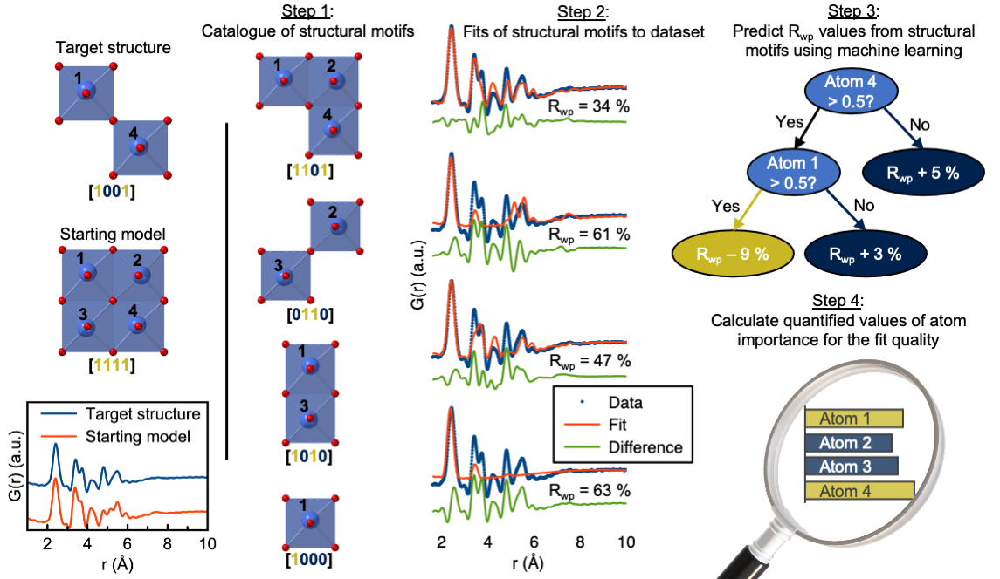

[ChemRxiv](https://chemrxiv.org/engage/chemrxiv/article-details/6263f48f5b900913a0195c4f)  |  [Paper](https://www.nature.com/articles/s41524-022-00896-3)

# Machine Learning based Motif Extractor (ML-MotEx)

We provide our code for Machine Learning based Motif Extractor (ML-MotEx), which is a tool to extract structural motifs from numerous fits using explainable machine learning.
ML-MotEx first builds a catalogue of hundreds or thousands of candidate structure motifs which are all ‘cutouts’ from a chosen starting structure (Step 1), and then fit these individual models to a dataset (Step 2). The results from these fits are then handed to a ML algorithm (Step 3), and using SHAP (SHapley Additive exPlanation) values, the machine identifies which atoms are important for the fit quality (Step 4), such that structural motifs can be extracted from a dataset.

Note that the code to step 2 presented here is specific for data analysis of Pair Distribution Function data. If data from other techniques is used, one can go directly to step 3+4 of the algorithm which will guide the user to set up the data (Step 1 + fits) in the appropriate manner and use step 3+4 of ML-MotEx.



One of the bottlenecks in structural analysis using e.g. Pair Distribution Function (PDF) analysis or other scattering methods is identifying an atomic model for structure refinement. Recently, new modelling approaches have made it possible to test thousands of models against a dataset in an automated manner, but one of the challenges when using such methods is analyzing the output, i.e. extracting structural information from the thousands of fits in a meaningful way. We here use explainable machine learning to identify structural motifs present in nanomaterials from PDFs based on an automated modelling approach.
We have demonstrated the use of the algorithm on data from 4 different chemical systems consisting of disordered materials and ionic clusters. Furthermore, we showed that the algorithm achieves comparable results using 4 different starting models but the same dataset. ML-MotEx opens for a new type of modelling where each atom or structural feature in a model is assigned an importance value for the fit quality based on Machine Learning. 

# How to use ML-MotEx
Follow these step if you want to use ML-MotEx.

## Install requirements
If you want to use ML-MotEx locally on your own computer, see the [install](/Install) folder.

## Using ML-MotEx to calculate atom contribution values
Use ML-MotEx to calculate atom contribution values straightforwardly without any installation or downloads to your computer. Follow the instructions in our [Colab notebook](https://colab.research.google.com/github/AndySAnker/ML-MotEx/blob/main/ML_MotEx_Colab.ipynb) and try to play around.

## Using ML-MotEx to calculate stacking fault distributions
Use ML-MotEx to calculate stacking fault distributions straightforwardly without any installation or downloads to your computer. Follow the instructions in our [Colab notebook](https://colab.research.google.com/drive/17tM8EageV1K2Itq0oFPf17P43Ll1C0oE#scrollTo=jFc0SvpzwVOs) and try to play around.

### Citation
If you use our code or our results, please consider citing our paper. Thanks in advance!

```
@article{anker2022ML-MotEx,
  title={Extracting Structural Motifs from Pair Distribution Function Data of Nanostructures using Explainable Machine Learning},
  author={Andy S. Anker, Emil T. S. Kjær, Mikkel Juelsholt, Troels Lindahl Christiansen, Susanne Linn Skjærvø, Mads Ry Vogel Jørgensen, Innokenty Kantor, Daniel Risskov Sørensen, Simon J. L. Billinge, Raghavendra Selvan and Kirsten M. Ø. Jensen},
  booktitle={ChemRxiv},
  year={2022}}
```

### Contact
ansoan@dtu.dk

### Acknowledgments
Our code is developed based on the following publications:
```
@article{LindahlChristiansen:kc5101,
   title = "{Structure analysis of supported disordered molybdenum oxides using pair distribution function analysis and automated cluster modelling}",
   author = "Lindahl Christiansen, Troels and Kjær, Emil T. S. and Kovyakh, Anton and Röderen, Morten L. and Høj, Martin and Vosch, Tom and Jensen, Kirsten M. Ø.",
   journal = "Journal of Applied Crystallography"}}

@article{anker2022ML-MotEx,
   title={Extracting Structural Motifs from Pair Distribution Function Data of Nanostructures using Explainable Machine Learning},
   author={Andy S. Anker, Emil T. S. Kjær, Mikkel Juelsholt, Troels Lindahl Christiansen, Susanne Linn Skjærvø, Mads Ry Vogel Jørgensen, Innokenty Kantor, Daniel R. Sørensen, Simon J. L. Billinge, Raghavendra Selvan, Kirsten M. Ø. Jensen},
   journal = {npj Computational Materials},
   volume = {8},
   number = {1},
   pages = {213},
   ISSN = {2057-3960},
   DOI = {10.1038/s41524-022-00896-3},
   url = {https://doi.org/10.1038/s41524-022-00896-3},
   year = {2022}}
```

### LICENSE
This project is licensed under the Apache License Version 2.0, January 2004 - see the LICENSE file for details.
